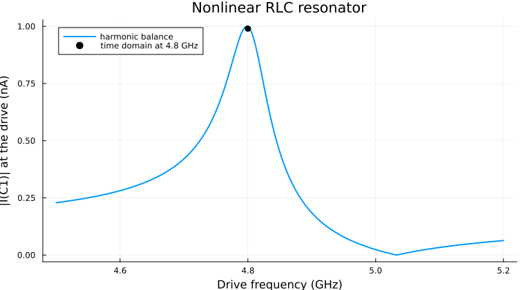
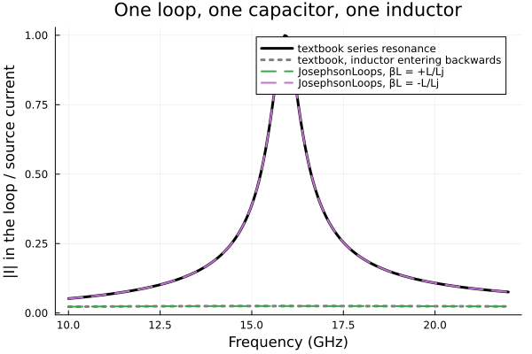
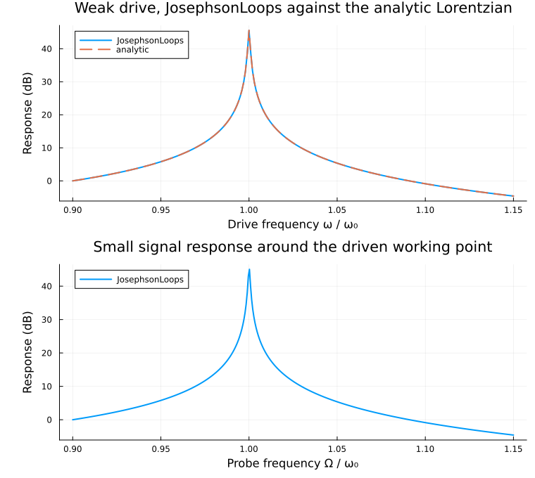

# JosephsonLoops.jl

JosephsonLoops.jl is an open source package for simulating lumped element superconducting
circuits containing Josephson junctions. It solves circuits in the time domain and in the
frequency domain using harmonic balance.

The package is built on [ModelingToolkit.jl](https://github.com/SciML/ModelingToolkit.jl).
A circuit is described as a set of loops, assembled into a symbolic model, and then solved
either as an initial value problem or as a harmonic balance problem.

## Contents

- [Why loop currents](#why-loop-currents)
- [Installation](#installation)
- [Quick start](#quick-start)
- [Defining a circuit](#defining-a-circuit)
- [Units and normalisation](#units-and-normalisation)
- [Time domain](#time-domain)
- [Harmonic balance](#harmonic-balance)
- [Small signal analysis](#small-signal-analysis)
- [Examples](#examples)
  - [Nonlinear RLC resonator](#nonlinear-rlc-resonator)
  - [Josephson parametric amplifier](#josephson-parametric-amplifier)
  - [Doubly pumped Josephson parametric amplifier](#doubly-pumped-josephson-parametric-amplifier)
  - [rf-SQUID coupler](#rf-squid-coupler)
  - [Inductor sign check](#inductor-sign-check)
  - [Driven Duffing oscillator](#driven-duffing-oscillator)
- [Benchmark summary](#benchmark-summary)
- [Current status](#current-status)

## Why loop currents

Most harmonic balance simulators for superconducting circuits, including
[JosephsonCircuits.jl](https://github.com/kpobrien/JosephsonCircuits.jl), use a nodal
formulation. They solve for node fluxes. JosephsonLoops.jl uses a mesh formulation instead.
It solves for loop currents, and the circuit is entered as a list of loops rather than as a
list of node pairs.

Two practical consequences follow from this.

External flux is a first class part of the netlist. You mark which loops are threaded by
external flux and set the flux directly as a parameter. In a nodal formulation, applying
external flux normally requires a DC current source at an extra port coupled through a
mutual inductor, plus a large parallel inductor to keep the DC node flux from floating.

Flux quantisation is enforced by construction, because each loop equation is a statement
about the flux around that loop.

## Installation

The package is not registered. Install it directly from the repository.

```julia
using Pkg
Pkg.add(url = "https://github.com/WilliamCam/JosephsonLoops.git")
```

To work on the package itself, clone it and develop the local copy.

```julia
using Pkg
Pkg.develop(path = "path/to/JosephsonLoops")
```

Julia 1.12 or later is required. The floor comes from the `LinearAlgebra = "1.12.0"` compat
entry, since that stdlib tracks the Julia version. The simulation path is built on ModelingToolkit, Symbolics, NonlinearSolve and
DifferentialEquations, and figures use Plots. `Project.toml` declares more than that, and some
of those are not used by the package as it stands; see Current status. The first build of a
harmonic system is a symbolic operation, so expect the first call in a session to be slow.

The module does not export any names, so every name must be qualified. Every example uses a
short alias.

The functions the examples call carry docstrings giving their arguments, return values and
known traps. Because nothing is exported, help lookups must be qualified too.

```julia
using JosephsonLoops
const jls = JosephsonLoops

?jls.HarmonicSystem                # or ?JosephsonLoops.HarmonicSystem without the alias
```

## Quick start

One loop holding a port, a coupling capacitor and a junction in series. This is the circuit
used for the parametric amplifier example below.

```julia
using JosephsonLoops
const jls = JosephsonLoops

# one loop containing a port, a coupling capacitor and a junction
loops = [["P1", "C1", "J1"]]
circuit = jls.process_netlist(loops)
model, u0, guesses = jls.build_circuit(circuit)

# choose the normalisation scales
I₀ = jls.Φ₀/(2π*1000.0e-12)     # critical current of a 1000 pH junction
R₀ = 10.0e3                      # reference resistance
ωc = R₀*I₀/(jls.Φ₀/2π)           # characteristic frequency

ps = Dict(
    jls.P1.source.ω => 2π*4.75001e9/ωc,   # drive frequency
    jls.P1.source.I => 11.3e-9/I₀,        # drive amplitude
    jls.P1.Rₙ.r     => 50.0/R₀,           # 50 ohm port
    jls.C1.βc       => 100.0e-15*R₀*ωc,   # 100 fF coupling capacitor
    jls.J1.βc       => 1000.0e-15*R₀*ωc,  # 1000 fF junction capacitance
    jls.J1.r        => 1e8/R₀,            # junction shunt resistance
    jls.J1.α        => 1.0,               # junction critical current, in units of I₀
)

# harmonic balance with 2 harmonics of the drive
sys = jls.HarmonicSystem(model, jls.P1.source.ω, 2)

# sweep the drive frequency, removed here from the fixed parameters. delete! mutates, so
# the copy keeps ps intact for later use
ω_vec = collect(2π*(4.5:0.001:5.0)*1e9/ωc)
sweep_params = delete!(copy(ps), jls.P1.source.ω)
prob = jls.HarmonicProblem(sys, sweep_params, parameter_sweep = [jls.P1.source.ω => ω_vec])
jls.solve!(prob)

# first harmonic of the port current and voltage
I1 = jls.get_solution(prob, jls.P1.i, 1) .* I₀
V1 = jls.get_solution(prob, jls.P1.dφ, 1) .* R₀ .* I₀
```

`get_solution` returns a complex phasor for the requested harmonic. Order `1` is the drive
frequency, `2` is its second harmonic, and `0` is DC. For two tone problems the order is a
tuple, so `(1, -1)` is the mixing product at `ω1 - ω2`.

## Defining a circuit

A circuit is a vector of loops. Each loop is a vector of component names. A component that
appears in two loops is the shared branch between them.

```julia
loops = [["P1", "L1"], ["L1", "J1", "L2"], ["L2", "P2"]]
circuit = jls.process_netlist(loops, ext_flux = [false, true, false])
model, u0, guesses = jls.build_circuit(circuit)
```

The first letter of a component name selects its type.

| Prefix | Component | Parameters | Defining equation |
|---|---|---|---|
| `R` | Resistor | `r` | `D(φ) ~ i*r` |
| `C` | Capacitor | `βc` | `D2(φ) ~ i/βc` |
| `L` | Inductor | `βL` | `in.Φ ~ βL*i` |
| `J` | Josephson junction | `βc`, `r`, `α` | `D2(φ) ~ (i - α*sin(φ) - D(φ)/r)/βc` |
| `I` | Current source | `I`, `ω`, `I₂`, `ω₂` | `i ~ I*sin(ω*t) + I₂*sin(ω₂*t)` |
| `P` | Port | `Rₙ.r`, `source.I`, `source.ω` | resistor in parallel with a current source |

Component handles such as `jls.P1` and `jls.J1` are created by `build_circuit`, which
generates them as module level names taken from the netlist strings. They do not exist before
that call. This is why parameters are written as `jls.J1.α` even though `J1` never appears in
your own code.

A port is a composite. It contains a resistor `Rₙ` and a current source `source`, and it
exposes the port current `i` and the port voltage `dφ`. Port parameters are reached through
those subcomponents, for example `jls.P1.Rₙ.r` and `jls.P1.source.ω`.

The current source carries an optional second tone through `I₂` and `ω₂`. It defaults to
zero amplitude, so single tone circuits are unaffected. Both pumps of a two tone problem
should be driven through one port using this second tone. Adding a second source as its own
netlist component inserts an extra branch and changes the circuit.

Two optional keyword arguments extend the netlist.

`mutual_coupling` is a vector of loop index pairs. Each pair creates a plain inductor named
`M` followed by the two loop numbers, placed as a branch shared by both loops. This is the
common branch representation of mutual inductance in mesh analysis, rather than a separate
coupling coefficient. Its single parameter is a normal `βL`, so `mutual_coupling = [(1, 2)]`
creates `M12` and its mutual inductance is set through `jls.M12.βL`.

`ext_flux` is a vector of booleans, one per loop. Each `true` entry threads that loop with an
external flux source named `Φₑ` followed by the loop number. Loop 2 in the example above gets
`jls.Φₑ2.Φₑ`.

## Units and normalisation

The package works in normalised units. Fluxes are in units of `Φ₀/2π`, currents in units of
a reference current `I₀`, resistances in units of a reference resistance `R₀`, and time in
units of `1/ωc`. You choose `I₀` and `R₀`, and the characteristic frequency follows.

```julia
ωc = R₀*I₀/(jls.Φ₀/2π)
```

A convenient choice is to set `I₀` to the critical current of the main junction, because then
that junction has `α = 1`. The flux quantum is available as `jls.Φ₀`.

Convert SI values as follows.

| Physical quantity | Normalised parameter | Conversion |
|---|---|---|
| Resistance `R` in ohms | `r` | `R/R₀` |
| Capacitance `C` in farads | `βc` | `C*R₀*ωc` |
| Inductance `L` in henries | `βL` | `L*I₀/(Φ₀/2π)` |
| Critical current `Ic` in amps | `α` | `Ic/I₀` |
| Source current in amps | `I` | `I/I₀` |
| Frequency `f` in hertz | `ω` | `2π*f/ωc` |
| External flux in units of `Φ₀` | `Φₑ` | `2π*flux` |

Results come back normalised, so multiply currents by `I₀` and voltages by `R₀*I₀` to return
to SI units.

## Time domain

The same model can be integrated as an initial value problem. This is useful for checking a
harmonic balance result, and for transients that harmonic balance cannot represent.

```julia
tspan = (0.0, 1e-6) .* ωc
tsol = jls.tsolve(model, guesses, ps, tspan; guesses = guesses)
jls.plot(tsol[jls.C1.i] .* I₀)
```

Note that `tspan` is in normalised time, so multiply the physical duration by `ωc`. An
optional `saveat` argument controls the output sampling. Time domain solves are far slower
than harmonic balance for steady state problems, which is the reason harmonic balance exists.

## Harmonic balance

Harmonic balance assumes the solution is a Fourier series in the drive tones, substitutes
that series into the circuit equations, samples the result on a collocation grid, and solves
the resulting algebraic system for the Fourier coefficients.

Build a harmonic system by naming the drive parameter and the number of harmonics.

```julia
sys = jls.HarmonicSystem(model, jls.P1.source.ω, N; determine_jacobian = false)
```

`N` is the number of harmonics of the drive retained in the basis. `N = 2` keeps DC, the
fundamental and the second harmonic. Increasing `N` improves accuracy and costs build time.
For the parametric amplifier below, `N = 2` gives 13.119 dB and `N = 3` gives 13.295 dB
against a reference value of 13.301 dB, so `N = 3` is converged for that circuit.

Set `determine_jacobian = true` if you intend to do small signal analysis afterwards. This
builds the additional matrices the linearised solver needs. It also forces `tearing = false`,
because the linearised solve needs every system variable to survive into the final model.

For a steady state sweep, wrap the system in a `HarmonicProblem`.

```julia
prob = jls.HarmonicProblem(sys, ps, parameter_sweep = [jls.P1.source.ω => ω_vec])
jls.solve!(prob)
result = jls.get_solution(prob, jls.P1.i, 1)
```

`solve!` continues by default: each point of the first sweep axis starts from the previous
converged solution, which is what lets a sweep follow a nonlinear branch. Passing more than
one pair sweeps a grid, and `get_solution` then returns an array with one axis per swept
parameter.

The examples delete the swept parameter from `ps` first. That is a convenience, not a
requirement: every component parameter carries a default, so the problem can be built without
it. A parameter with no default, such as one declared with `@parameters` on a differential
equation of your own, must still be given a value, because the problem is built before the
sweep starts.

### Two tones

Pass a tuple of two drive parameters to build a two tone system.

```julia
sys = jls.HarmonicSystem(model, (jls.P1.source.ω, jls.P1.source.ω₂), 2,
    determine_jacobian = true,
    intermod_order = 3,
    tones = (4.65001e9, 4.85001e9))
```

`intermod_order` controls which mixing products enter the basis. With `intermod_order = 0`
the basis holds only pure harmonics of each tone. Raising it admits mixing products `(m, n)`
at frequency `m*ω1 + n*ω2` subject to `m + |n| <= intermod_order`, which is where parametric
conversion between the tones actually happens. For the doubly pumped amplifier below the peak
gain is 15.2 dB at order 0, 11.8 at order 2 and 10.56 at order 3, converging onto the
reference value of 10.553 dB. Order 0 is not a useful setting for a strongly driven circuit.

`tones` takes the two drive frequencies as plain numbers. Only their ratio is used, so any
consistent unit works. The backend inspects that ratio and chooses a collocation grid.

If the ratio is close to a small rational number, the two tones share a common base frequency
`ω0` with `ω1 = p*ω0` and `ω2 = q*ω0`. Every mixing product is then an integer harmonic of
`ω0`, one period of `ω0` is a valid sampling window, and a one dimensional grid is exact. The
frequencies above rationalise to 93:97, which moves the second tone by 430 Hz. The chosen
ratio and the size of that shift are reported when the system is built.

If the ratio is not close to a small rational number, or if `tones` is omitted, the backend
falls back to sampling the two tone phases independently, so both drive frequencies stay
symbolic and no shift is applied to either tone. The doubly pumped example uses a simple
rational ratio, so it always takes the commensurate grid, and that is the only path the
benchmark below exercises.

The grid choice only matters once the basis is converged. At `intermod_order = 0` the result
is several dB out at the gain peak whatever the grid, because the basis does not contain the
mixing products that carry the parametric conversion.

Two keyword arguments tune the choice. `commensurate_tol` is the relative tolerance for
accepting a rational ratio, and defaults to `1e-6`. `max_denominator` caps the integers that
may be used, and defaults to `1000`. A third argument, `oversample`, increases the number of
collocation points beyond the minimum, which pushes aliased content off the occupied basis
slots.

### Working points

Strongly driven circuits have more than one solution, and a cold Newton solve can land on the
trivial one. The reliable approach is to ramp the drive amplitude and carry each solution
forward as the starting guess for the next step.

```julia
sysu = jls.unknowns(sys.system)
U = fill(0.0, length(sysu))
for frac in (0.05, 0.15, 0.3, 0.5, 0.7, 0.85, 1.0)
    p = copy(ps)
    p[jls.P1.source.I] = frac * Ip
    prob = jls.NonlinearProblem(sys.system, merge(Dict(sysu .=> U), p))
    sol = jls.ModelingToolkit.solve(prob, jls.NonlinearSolve.LevenbergMarquardt(); maxiters = 2000)
    @assert maximum(abs.(sol.resid)) < 1e-9 "working point did not converge"
    global U = real.(sol.u)
end
```

Levenberg-Marquardt is used because the DC coefficients are gauge free, which makes the
Newton jacobian singular. Always check the returned residual rather than assuming
convergence. A stalled solve returns a state that looks like an answer.

## Small signal analysis

Once a working point is known, the response to a weak probe is a linear problem. This is how
amplifier gain and S parameters are computed. The pump stays fixed and the probe frequency is
swept across it.

```julia
sys = jls.HarmonicSystem(model, jls.P1.source.ω, 2, determine_jacobian = true)
δU  = jls.perturbation_response(sys, jls.P1.source.I, ps, amplitude = ps[jls.P1.source.I])
lin = jls.LinearisedProblem(sys, ps, δU, Ω_vec, U₀ = U)
jls.solve!(lin)

I_sig = jls.get_solution(lin, jls.P1.i, 1) .* I₀
V_sig = jls.get_solution(lin, jls.P1.dφ, 1) .* R₀ .* I₀
```

`perturbation_response` builds the drive vector for a small modulation of the named
parameter. `LinearisedProblem` takes that vector and the list of probe frequencies `Ω_vec`.
The optional `U₀` is the working point computed above. `get_solution` then returns the
complex response at each probe frequency.

Scattering parameters follow from the port power waves.

```julia
Z0 = 50.0
a = @. 0.5*(V_sig + Z0*I_sig)/sqrt(Z0)
b = @. 0.5*(V_sig - Z0*I_sig)/sqrt(Z0)
gain_dB = 20 .* log10.(abs.(b ./ a))
```

Internally the linearised operator is assembled from three jacobians. A probe at frequency
`Ω = ω1 + δ` puts a slowly rotating envelope on every Fourier coefficient. Because the
circuit equations contain second time derivatives, the operator is exactly quadratic in the
detuning, and the solved matrix is `J₀ - iδJ₁ - δ²J₂`. The series terminates, so the
linearised response is exact in the detuning for the chosen basis.

## Examples

All six example scripts live in `src/examples`, and all of them run as written. Each one prints the
numbers quoted here and regenerates its own figure. The reference data used in the comparisons
is generated by the scripts at the repository root, which must be run with the
JosephsonCircuits.jl project rather than this one.

| Example | What it demonstrates |
|---|---|
| `RLC.jl` | the two solvers on one circuit, time domain against harmonic balance |
| `RLC-ports.jl` | `HarmonicProblem` and `LinearisedProblem`, amplifier gain, the single tone benchmark |
| `multitone-jpa-benchmark.jl` | two pumps through one port, commensurate grid, the two tone benchmark |
| `rf-squid-coupler.jl` | flux swept working points with continuation, two port S21 |
| `inductor-sign.jl` | two components and a closed form, isolating the inductor sign convention |
| `duffing-oscillator.jl` | the solver on a bare differential equation, with no circuit or netlist |

### Nonlinear RLC resonator

A current source driving a 50 ohm resistor in parallel with a series branch of a coupling
capacitor and a Josephson junction. The junction carries its own capacitance, so the branch
has a series resonance, where the capacitor cancels the junction inductance and the branch
carries the most current, and a parallel resonance, where the junction and its capacitance
cancel each other and it carries the least.



The same circuit is then integrated in the time domain at the series resonance, and the steady
state amplitude is measured from the tail of the transient. That value is the black point on
the figure. Checking a harmonic balance result against a time domain solve of the same circuit
is the cheapest confidence you can buy, and it is the reason this example exists.
At the series resonance the harmonic balance amplitude is 0.999 nA and the time domain amplitude is 0.990 nA, a difference of 0.87 percent.

Script: `src/examples/RLC.jl`.

### Josephson parametric amplifier

A single junction parametric amplifier, pumped just above its resonance. The circuit is a
50 ohm port, a 100 fF coupling capacitor, and a 1000 pH junction shunted by 1000 fF. This is
the amplifier from the JosephsonCircuits.jl documentation, so the two packages can be
compared directly.


The gain peak is 13.119 dB at 4.750 GHz with a 3 dB bandwidth of 12.0 MHz. JosephsonCircuits.jl
reports 13.301 dB at the same frequency and the same 12 MHz bandwidth. The median difference
across the band is 0.000183 dB. Raising the basis to `N = 3` moves the peak to 13.295 dB,
within 0.006 dB of the reference.

One convention matters when comparing drive amplitudes. The `current` argument in
JosephsonCircuits.jl is a one sided spectral amplitude, which is half the peak amplitude of
an `I*sin(ωt)` source. The reference's 5.65 nA is 11.3 nA here, which is why `I_pump` is
set to twice the reference value.

The script also integrates the same circuit in the time domain at 100 MHz, well below the
resonance, as a sanity check that the model solves as an initial value problem too.

Script: `src/examples/RLC-ports.jl`. Reference: `mit_jpa_export.jl`, which writes `mit_jpa.csv`.

### Doubly pumped Josephson parametric amplifier

The same amplifier driven by two pumps at 4.65001 GHz and 4.85001 GHz. Both pumps enter
through the single port using the current source second tone. This example is the doubly
pumped amplifier from the JosephsonCircuits.jl documentation, where it is also validated
against WRspice.


The gain peak is 10.569 dB at 4.750 GHz against a reference value of 10.553 dB at the same
frequency. The median difference across the band is 0.0008 dB. Every step of the pump ramp
converges to a residual below 1e-13, which the example prints and gates on.

The pump ratio 4.65:4.85 reduces to 93:97, so the two tones share a base frequency near
50 MHz and the commensurate grid applies. The second pump is shifted by 430 Hz to make the
ratio exact, more than four orders of magnitude below the 12 MHz gain linewidth. The example sets `ω₂`
to the shifted value directly so the parameter and the grid agree.

The build takes about 12 minutes at `intermod_order = 3`. It is not hung.

Script: `src/examples/multitone-jpa-benchmark.jl`. Reference: `mit_jpa_multitone_export.jl`,
which writes `mit_jpa_multitone.csv`.

### rf-SQUID coupler

A two port flux tunable coupler. A junction sits in series between two ports, and the loop
formed with the two grounding inductors is threaded by external flux. Transmission through
the coupler is controlled by that flux. This circuit is figure 8 of
[arXiv:2408.07861](https://arxiv.org/abs/2408.07861).


There is no pump in this example. The working point is the flux biased DC state and the
5 GHz probe enters only through the linearised response. Transmission rises from about
-40 dB at zero flux to a peak at half a flux quantum, with the peak height set by `βL`. At
`βL = 1` the coupler reaches 0 dB. Sharp transmission nulls appear on either side of the
peak, and their positions depend on `βL`.

Both ports must have their source amplitude set to zero. The port current source defaults to
an amplitude of 1, so an unset second port silently drives the circuit.

The `+0.5` on the external flux is a workaround, not physics. It compensates the inductor's
sign convention in the component library, which is isolated on a two component circuit in
the example below.

Script: `src/examples/rf-squid-coupler.jl`. Reference: `mit_rf_squid_coupler.jl`, which
writes `mit_rf_squid_coupler.csv`.

### Inductor sign check

One loop holding a port, a capacitor and an inductor, which is the smallest circuit that can
settle whether the inductor's sign convention is right. Such a loop has one series resonance,
where the two reactances cancel and the branch carries the whole source current. If the
inductor's parity disagrees with the other components the reactances add instead, and the
resonance cannot happen.



Negating a parameter is the same thing as flipping the sign in the equation, so the example
solves the same circuit twice, with `βL = +L/Lj` and `βL = -L/Lj`, and compares both against
the textbook series resonance and against the textbook curve for an inductor entering
backwards. At 10 nH and 10 fF the resonance is at 15.9 GHz, and the two runs give:

| `βL` | peak loop current | against the series resonance | against an inductor reversed |
|---|---|---|---|
| `+L/Lj`, as the library defines it | 0.025 of the source current | 97.5 percent out | matches to 1.6e-8 percent |
| `-L/Lj` | 0.999 of the source current | matches to 7.7e-10 percent | 3900 percent out |

Script: `src/examples/inductor-sign.jl`.

### Driven Duffing oscillator

Not a circuit. The harmonic balance backend takes any ModelingToolkit system, so the same
code path that solves a Josephson circuit solves

```
ẍ + γẋ + ω₀²x + αx³ + ηẋx² = F cos(ωt)
```

which is worth having because the answer is known in closed form in two limits.



At a weak drive the response must be the linear Lorentzian, so the example checks it against
the closed form: the peak is 0.00995 against an analytic 0.01, the largest deviation being
0.52 percent of the peak. That is the solver measured against an exact answer rather than
against another solver. The second panel is the small signal response around that working
point, which is the same linearisation the amplifier examples use for gain; at this working
point the probe sees the oscillator's own resonance, 303 times its off resonant level.

This oscillator is also bistable once the drive bends the resonance, but its fold lies outside
any window that still contains the linear resonance, so it is left out.

Script: `src/examples/duffing-oscillator.jl`.

## Benchmark summary

| Example | JosephsonLoops | Reference | Difference |
|---|---|---|---|
| JPA gain peak | 13.119 dB at `N = 2`, 13.295 dB at `N = 3` | 13.301 dB | 0.006 dB at `N = 3` |
| JPA 3 dB bandwidth | 12.0 MHz | 12 MHz | matched |
| Doubly pumped JPA peak | 10.569 dB | 10.553 dB | 0.016 dB |
| Doubly pumped JPA band | median difference 0.000797 dB | | |
| Coupler, `βL = 0.6` to `1.0`, whole flux sweep | see the example | JosephsonCircuits.jl | max 0.18 dB, median 0.0006 dB |
| RLC resonator, harmonic balance against time domain | 0.999 nA | 0.990 nA from the transient | 0.87 percent |

Every reference here is JosephsonCircuits.jl, generated by the export scripts at the
repository root, except the RLC resonator row, which compares harmonic balance against this
package's own time domain solve of the same circuit. Every row is printed by the example
that produces it. The two tone example selects
its collocation grid from the tone ratio, and at the ratio used here that is always the
commensurate grid, so only the commensurate result is quoted.

## Current status

This package is under active development as part of a masters thesis. The following areas are
known to be incomplete.

Parameter sweeps in `LinearisedProblem` are not implemented. The branch exists but is empty,
so linear component sweeps still require re-solving the working point.

There is no test suite. Correctness is currently established by the benchmark examples above.

Building a `LinearisedProblem` substitutes the harmonic system's symbolic jacobians numerically
each time, so a sweep that constructs one per point is dominated by that cost rather than by the
linear solve. The coupler example, which builds a thousand of them, spends most of its runtime
there. Working points swept through `HarmonicProblem` do not pay this.

A parameter sweep moves one parameter per axis, so two parameters that must change together,
such as the two loop inductors of a SQUID or the two tones of a doubly pumped amplifier, need
a loop around the sweep rather than a sweep axis of their own.

`solve!` does not forward keyword arguments to the nonlinear solver, so the algorithm cannot
be chosen through `HarmonicProblem`. Where a specific solver matters, the calling code has to
build the `NonlinearProblem` itself, as the two tone example does for its pump ramp.

`get_HB_scattering_matrix` is correct for a one port network. Its loop over ports is written
`for k in N_ports`, which iterates once over the integer rather than over the ports, so the
two port case leaves the first wave at zero.

The ensemble sweep helpers `ensemble_fsolve` and `ensemble_parameter_sweep` call `mean`
without importing `Statistics`, so they raise an `UndefVarError` when used.

`build_circuit` prints the branch names and the full component dictionary on every call, with
no way to silence it. The second return value, `u0`, is always an empty vector, because the
line that would populate it is commented out. Pass `guesses` where an initial state is needed,
which is what the examples do.

Only the component prefixes `I`, `R`, `C`, `J`, `L` and `P` are recognised. A netlist entry
starting with any other letter is silently dropped during parsing and then fails later with a
bare `KeyError` for that name.

The inductor's sign convention is wrong. `Inductor` defines `in.Φ ~ βL*i`, which gives the
opposite parity to every `Branch` element, so an inductor delivers its flux to a loop with the
opposite sign to a junction, capacitor or resistor carrying the same current. `inductor-sign.jl`
measures this on one loop holding one capacitor and one inductor: as written the library
reproduces the textbook curve for an inductor connected backwards to 1.6e-8 percent, and misses
the real series resonance by 97.5 percent. Negating `βL` reverses both. The fix is one line in
`component_library.jl`, `in.Φ ~ -βL*i`, and it is what the coupler examples' half flux quantum
offset is compensating for.
