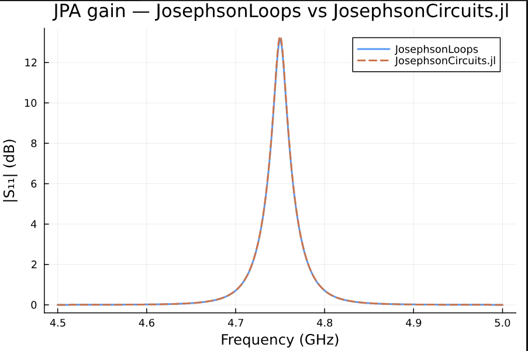
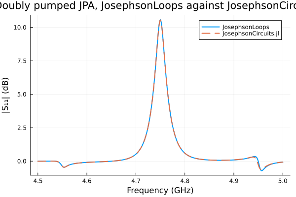
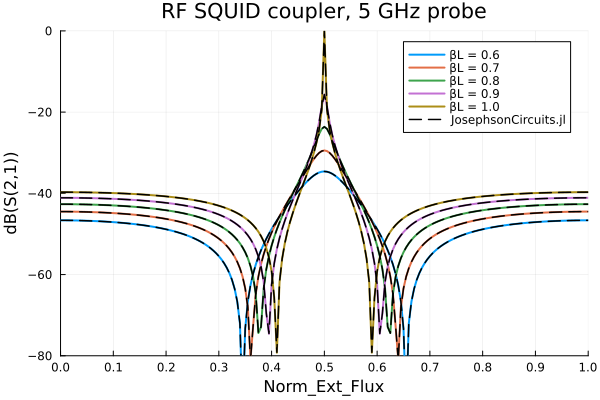
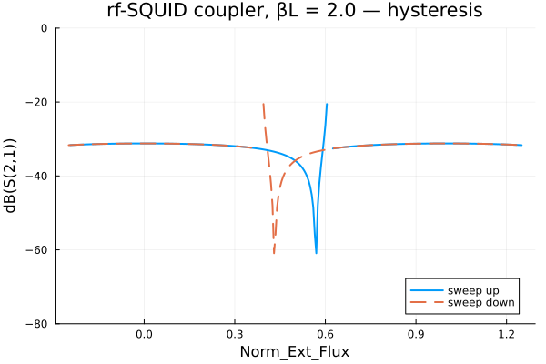

# JosephsonLoops.jl

JosephsonLoops.jl is an open source package for simulating lumped element superconducting
circuits containing Josephson junctions. It solves circuits in the time domain and in the
frequency domain using harmonic balance.

The package is built on [ModelingToolkit.jl](https://github.com/SciML/ModelingToolkit.jl).
A circuit is described as a set of loops, assembled into a symbolic model, and then solved
either as an initial value problem or as a harmonic balance problem.

## Contents

- [Why loop currents](#why-loop-currents)
- [Installation](#installation)
- [Quick start](#quick-start)
- [Defining a circuit](#defining-a-circuit)
- [Units and normalisation](#units-and-normalisation)
- [Harmonic balance](#harmonic-balance)
- [Small signal analysis](#small-signal-analysis)
- [Examples](#examples)
  - [Josephson parametric amplifier](#josephson-parametric-amplifier)
  - [Doubly pumped Josephson parametric amplifier](#doubly-pumped-josephson-parametric-amplifier)
  - [RF SQUID coupler](#rf-squid-coupler)
  - [Hysteretic RF SQUID coupler](#hysteretic-rf-squid-coupler)
- [Benchmark summary](#benchmark-summary)
- [Current status](#current-status)

## Why loop currents

Most harmonic balance simulators for superconducting circuits, including
[JosephsonCircuits.jl](https://github.com/kpobrien/JosephsonCircuits.jl), use a nodal
formulation. They solve for node fluxes. JosephsonLoops.jl uses a mesh formulation instead.
It solves for loop currents, and the circuit is entered as a list of loops rather than as a
list of node pairs.

Two practical consequences follow from this.

External flux is a first class part of the netlist. You mark which loops are threaded by
external flux and set the flux directly as a parameter. In a nodal formulation, applying
external flux normally requires a DC current source at an extra port coupled through a
mutual inductor, plus a large parallel inductor to keep the DC node flux from floating.

Flux quantisation is enforced by construction, because each loop equation is a statement
about the flux around that loop.

## Installation

The package is not registered. Install it directly from the repository.

```julia
using Pkg
Pkg.add(url = "https://github.com/WilliamCam/JosephsonLoops.git")
```

To work on the package itself, clone it and develop the local copy.

```julia
using Pkg
Pkg.develop(path = "path/to/JosephsonLoops")
```

Julia 1.12 or later is required. The floor comes from the `LinearAlgebra = "1.12.0"` compat
entry, since that stdlib tracks the Julia version. The package depends on ModelingToolkit,
Symbolics, NonlinearSolve, DifferentialEquations and Plots. The first build of a harmonic
system is a symbolic operation, so expect the first call in a session to be slow.

The module does not export any names, so every name must be qualified. Every example uses a
short alias.

```julia
using JosephsonLoops
const jls = JosephsonLoops
```

## Quick start

A single junction shunted by a capacitor and driven through a port. This is the circuit
used for the parametric amplifier example below.

```julia
using JosephsonLoops
const jls = JosephsonLoops

# one loop containing a port, a coupling capacitor and a junction
loops = [["P1", "C1", "J1"]]
circuit = jls.process_netlist(loops)
model, u0, guesses = jls.build_circuit(circuit)

# choose the normalisation scales
I₀ = jls.Φ₀/(2π*1000.0e-12)     # critical current of a 1000 pH junction
R₀ = 10.0e3                      # reference resistance
ωc = R₀*I₀/(jls.Φ₀/2π)           # characteristic frequency

ps = Dict(
    jls.P1.source.ω => 2π*4.75001e9/ωc,   # drive frequency
    jls.P1.source.I => 11.3e-9/I₀,        # drive amplitude
    jls.P1.Rₙ.r     => 50.0/R₀,           # 50 ohm port
    jls.C1.βc       => 100.0e-15*R₀*ωc,   # 100 fF coupling capacitor
    jls.J1.βc       => 1000.0e-15*R₀*ωc,  # 1000 fF junction capacitance
    jls.J1.r        => 1e8/R₀,            # junction shunt resistance
    jls.J1.α        => 1.0,               # junction critical current, in units of I₀
)

# harmonic balance with 2 harmonics of the drive
sys = jls.HarmonicSystem(model, jls.P1.source.ω, 2)

# sweep the drive frequency, which must be removed from the fixed parameters
ω_vec = collect(2π*(4.5:0.001:5.0)*1e9/ωc)
sweep_params = delete!(ps, jls.P1.source.ω)
prob = jls.HarmonicProblem(sys, sweep_params, parameter_sweep = [jls.P1.source.ω => ω_vec])
jls.solve!(prob)

# first harmonic of the port current and voltage
I1 = jls.get_solution(prob, jls.P1.i, 1) .* I₀
V1 = jls.get_solution(prob, jls.P1.dφ, 1) .* R₀ .* I₀
```

`get_solution` returns a complex phasor for the requested harmonic. Order `1` is the drive
frequency, `2` is its second harmonic, and `0` is DC. For two tone problems the order is a
tuple, so `(1, -1)` is the mixing product at `ω1 - ω2`.

## Defining a circuit

A circuit is a vector of loops. Each loop is a vector of component names. A component that
appears in two loops is the shared branch between them.

```julia
loops = [["P1", "L1"], ["L1", "J1", "L2"], ["L2", "P2"]]
circuit = jls.process_netlist(loops, ext_flux = [false, true, false])
model, u0, guesses = jls.build_circuit(circuit)
```

The first letter of a component name selects its type.

| Prefix | Component | Parameters | Defining equation |
|---|---|---|---|
| `R` | Resistor | `r` | `D(φ) ~ i*r` |
| `C` | Capacitor | `βc` | `D2(φ) ~ i/βc` |
| `L` | Inductor | `βL` | `in.Φ ~ βL*i` |
| `J` | Josephson junction | `βc`, `r`, `α` | `D2(φ) ~ (i - α*sin(φ) - D(φ)/r)/βc` |
| `I` | Current source | `I`, `ω`, `I₂`, `ω₂` | `i ~ I*sin(ω*t) + I₂*sin(ω₂*t)` |
| `P` | Port | `Rₙ.r`, `source.I`, `source.ω` | resistor in parallel with a current source |

A port is a composite. It contains a resistor `Rₙ` and a current source `source`, and it
exposes the port current `i` and the port voltage `dφ`. Port parameters are reached through
those subcomponents, for example `jls.P1.Rₙ.r` and `jls.P1.source.ω`.

The current source carries an optional second tone through `I₂` and `ω₂`. It defaults to
zero amplitude, so single tone circuits are unaffected. Both pumps of a two tone problem
should be driven through one port using this second tone. Adding a second source as its own
netlist component inserts an extra branch and changes the circuit.

Two optional keyword arguments extend the netlist.

`mutual_coupling` is a vector of loop index pairs. Each pair creates a plain inductor named
`M` followed by the two loop numbers, placed as a branch shared by both loops. This is the
common branch representation of mutual inductance in mesh analysis, rather than a separate
coupling coefficient. Its single parameter is a normal `βL`, so `mutual_coupling = [(1, 2)]`
creates `M12` and its mutual inductance is set through `jls.M12.βL`.

`ext_flux` is a vector of booleans, one per loop. Each `true` entry threads that loop with an
external flux source named `Φₑ` followed by the loop number. Loop 2 in the example above gets
`jls.Φₑ2.Φₑ`.

## Units and normalisation

The package works in normalised units. Fluxes are in units of `Φ₀/2π`, currents in units of
a reference current `I₀`, resistances in units of a reference resistance `R₀`, and time in
units of `1/ωc`. You choose `I₀` and `R₀`, and the characteristic frequency follows.

```julia
ωc = R₀*I₀/(jls.Φ₀/2π)
```

A convenient choice is to set `I₀` to the critical current of the main junction, because then
that junction has `α = 1`. The flux quantum is available as `jls.Φ₀`.

Convert SI values as follows.

| Physical quantity | Normalised parameter | Conversion |
|---|---|---|
| Resistance `R` in ohms | `r` | `R/R₀` |
| Capacitance `C` in farads | `βc` | `C*R₀*ωc` |
| Inductance `L` in henries | `βL` | `L*I₀/(Φ₀/2π)` |
| Critical current `Ic` in amps | `α` | `Ic/I₀` |
| Source current in amps | `I` | `I/I₀` |
| Frequency `f` in hertz | `ω` | `2π*f/ωc` |
| External flux in units of `Φ₀` | `Φₑ` | `2π*flux` |

Results come back normalised, so multiply currents by `I₀` and voltages by `R₀*I₀` to return
to SI units.

## Time domain

The same model can be integrated as an initial value problem. This is useful for checking a
harmonic balance result, and for transients that harmonic balance cannot represent.

```julia
tspan = (0.0, 1e-6) .* ωc
tsol = jls.tsolve(model, guesses, ps, tspan; guesses = guesses)
jls.plot(tsol[jls.C1.i] .* I₀)
```

Note that `tspan` is in normalised time, so multiply the physical duration by `ωc`. An
optional `saveat` argument controls the output sampling. Time domain solves are far slower
than harmonic balance for steady state problems, which is the reason harmonic balance exists.

## Harmonic balance

Harmonic balance assumes the solution is a Fourier series in the drive tones, substitutes
that series into the circuit equations, samples the result on a collocation grid, and solves
the resulting algebraic system for the Fourier coefficients.

Build a harmonic system by naming the drive parameter and the number of harmonics.

```julia
sys = jls.HarmonicSystem(model, jls.P1.source.ω, N; determine_jacobian = false)
```

`N` is the number of harmonics of the drive retained in the basis. `N = 2` keeps DC, the
fundamental and the second harmonic. Increasing `N` improves accuracy and costs build time.
For the parametric amplifier below, `N = 2` gives 13.119 dB and `N = 3` gives 13.295 dB
against a reference value of 13.301 dB, so `N = 3` is converged for that circuit.

Set `determine_jacobian = true` if you intend to do small signal analysis afterwards. This
builds the additional matrices the linearised solver needs.

For a steady state sweep, wrap the system in a `HarmonicProblem`.

```julia
prob = jls.HarmonicProblem(sys, ps, parameter_sweep = [jls.P1.source.ω => ω_vec])
jls.solve!(prob)
result = jls.get_solution(prob, jls.P1.i, 1)
```

### Two tones

Pass a tuple of two drive parameters to build a two tone system.

```julia
sys = jls.HarmonicSystem(model, (jls.P1.source.ω, jls.P1.source.ω₂), 2,
    determine_jacobian = true,
    intermod_order = 3,
    tones = (4.65001e9, 4.85001e9))
```

`intermod_order` controls which mixing products enter the basis. With `intermod_order = 0`
the basis holds only pure harmonics of each tone. Raising it admits mixing products `(m, n)`
at frequency `m*ω1 + n*ω2` subject to `m + |n| <= intermod_order`, which is where parametric
conversion between the tones actually happens. For the doubly pumped amplifier below the peak
gain is 15.2 dB at order 0, 11.8 at order 2 and 10.56 at order 3, converging onto the
reference value of 10.553 dB. Order 0 is not a useful setting for a strongly driven circuit.

`tones` takes the two drive frequencies as plain numbers. Only their ratio is used, so any
consistent unit works. The backend inspects that ratio and chooses a collocation grid.

If the ratio is close to a small rational number, the two tones share a common base frequency
`ω0` with `ω1 = p*ω0` and `ω2 = q*ω0`. Every mixing product is then an integer harmonic of
`ω0`, one period of `ω0` is a valid sampling window, and a one dimensional grid is exact. The
frequencies above rationalise to 93:97, which moves the second tone by 430 Hz. The chosen
ratio and the size of that shift are reported when the system is built.

If the ratio is not close to a small rational number, or if `tones` is omitted, the backend
falls back to a two dimensional torus grid. This samples the two tone phases independently,
so both frequencies remain symbolic and any ratio is allowed. See
[Current status](#current-status) for the validation state of this path.

Two keyword arguments tune the choice. `commensurate_tol` is the relative tolerance for
accepting a rational ratio, and defaults to `1e-6`. `max_denominator` caps the integers that
may be used, and defaults to `1000`. A third argument, `oversample`, increases the number of
collocation points beyond the minimum, which pushes aliased content off the occupied basis
slots.

### Working points

Strongly driven circuits have more than one solution, and a cold Newton solve can land on the
trivial one. The reliable approach is to ramp the drive amplitude and carry each solution
forward as the starting guess for the next step.

```julia
sysu = jls.unknowns(sys.system)
U = fill(0.0, length(sysu))
for frac in (0.05, 0.15, 0.3, 0.5, 0.7, 0.85, 1.0)
    p = copy(ps)
    p[jls.P1.source.I] = frac * Ip
    prob = jls.NonlinearProblem(sys.system, merge(Dict(sysu .=> U), p))
    sol = jls.ModelingToolkit.solve(prob, jls.NonlinearSolve.LevenbergMarquardt(); maxiters = 2000)
    global U = real.(sol.u)
end
```

Levenberg-Marquardt is used because the DC coefficients are gauge free, which makes the
Newton jacobian singular. Always check the returned residual rather than assuming
convergence. A stalled solve returns a state that looks like an answer.

## Small signal analysis

Once a working point is known, the response to a weak probe is a linear problem. This is how
amplifier gain and S parameters are computed. The pump stays fixed and the probe frequency is
swept across it.

```julia
sys = jls.HarmonicSystem(model, jls.P1.source.ω, 2, determine_jacobian = true)
δU  = jls.perturbation_response(sys, jls.P1.source.I, ps, amplitude = ps[jls.P1.source.I])
lin = jls.LinearisedProblem(sys, ps, δU, Ω_vec, U₀ = U)
jls.solve!(lin)

I_sig = jls.get_solution(lin, jls.P1.i, 1) .* I₀
V_sig = jls.get_solution(lin, jls.P1.dφ, 1) .* R₀ .* I₀
```

`perturbation_response` builds the drive vector for a small modulation of the named
parameter. `LinearisedProblem` takes that vector and the list of probe frequencies `Ω_vec`.
The optional `U₀` is the working point computed above. `get_solution` then returns the
complex response at each probe frequency.

Scattering parameters follow from the port power waves.

```julia
Z0 = 50.0
a = @. 0.5*(V_sig + Z0*I_sig)/sqrt(Z0)
b = @. 0.5*(V_sig - Z0*I_sig)/sqrt(Z0)
gain_dB = 20 .* log10.(abs.(b ./ a))
```

Internally the linearised operator is assembled from three jacobians. A probe at frequency
`Ω = ω1 + δ` puts a slowly rotating envelope on every Fourier coefficient. Because the
circuit equations contain second time derivatives, the operator is exactly quadratic in the
detuning, and the solved matrix is `J₀ - iδJ₁ - δ²J₂`. The series terminates, so the
linearised response is exact in the detuning for the chosen basis.

## Examples

All example scripts live in `src/examples`. The reference data used in the comparisons is
generated by the scripts at the repository root, which must be run with the
JosephsonCircuits.jl project rather than this one.

### Josephson parametric amplifier

A single junction parametric amplifier, pumped near twice its resonance. The circuit is a
50 ohm port, a 100 fF coupling capacitor, and a 1000 pH junction shunted by 1000 fF. This is
the amplifier from the JosephsonCircuits.jl documentation, so the two packages can be
compared directly.

```julia
loops = [["P1", "C1", "J1"]]
circuit = jls.process_netlist(loops)
model, u0, guesses = jls.build_circuit(circuit)

I₀ = jls.Φ₀/(2π*1000.0e-12)
R₀ = 10.0e3
ωc = R₀*I₀/(jls.Φ₀/2π)

ps = Dict(
    jls.P1.source.ω => 2π*4.75001e9/ωc,
    jls.P1.source.I => 11.3e-9/I₀,
    jls.P1.Rₙ.r     => 50.0/R₀,
    jls.C1.βc       => 100.0e-15*R₀*ωc,
    jls.J1.βc       => 1000.0e-15*R₀*ωc,
    jls.J1.r        => 1e8/R₀,
    jls.J1.α        => 1.0,
)

Ω_vec = collect(2π*(4.5:0.001:5.0)*1e9/ωc)
sys = jls.HarmonicSystem(model, jls.P1.source.ω, 2, determine_jacobian = true)
δU  = jls.perturbation_response(sys, jls.P1.source.I, ps, amplitude = ps[jls.P1.source.I])
jpa = jls.LinearisedProblem(sys, ps, δU, Ω_vec)
jls.solve!(jpa)
```



The gain peak is 13.119 dB at 4.750 GHz with a 3 dB bandwidth of 12.0 MHz. JosephsonCircuits.jl
reports 13.301 dB at the same frequency and the same 12 MHz bandwidth. The median difference
across the band is 0.000183 dB. Raising the basis to `N = 3` moves the peak to 13.295 dB,
within 0.006 dB of the reference.

One convention matters when comparing drive amplitudes. The `current` argument in
JosephsonCircuits.jl is a one sided spectral amplitude, which equals twice the amplitude of
our `I*sin(ωt)` source. Their 5.65 nA is our 11.3 nA.

Script: `src/examples/RLC-ports.jl`. Reference: `mit_jpa_export.jl`, which writes `mit_jpa.csv`.

### Doubly pumped Josephson parametric amplifier

The same amplifier driven by two pumps at 4.65001 GHz and 4.85001 GHz. Both pumps enter
through the single port using the current source second tone. This example is the doubly
pumped amplifier from the JosephsonCircuits.jl documentation, where it is also validated
against WRspice.

```julia
Ip = 2 * 1.7 * 0.00565e-6 / I₀

ps = Dict(
    jls.P1.source.ω  => 2π*4.65001e9/ωc,
    jls.P1.source.I  => Ip,
    jls.P1.source.ω₂ => (97/93)*2π*4.65001e9/ωc,
    jls.P1.source.I₂ => Ip,
    jls.P1.Rₙ.r      => 50.0/R₀,
    jls.C1.βc        => 100.0e-15*R₀*ωc,
    jls.J1.βc        => 1000.0e-15*R₀*ωc,
    jls.J1.r         => 1e8/R₀,
    jls.J1.α         => 1.0,
)

sys = jls.HarmonicSystem(model, (jls.P1.source.ω, jls.P1.source.ω₂), 2,
    determine_jacobian = true, intermod_order = 3, tones = (4.65001e9, 4.85001e9))
```



The gain peak is 10.563 dB at 4.750 GHz against a reference value of 10.553 dB at the same
frequency. The median difference across the band is 0.00063 dB.

The pump ratio 4.65:4.85 reduces to 93:97, so the two tones share a base frequency near
50 MHz and the commensurate grid applies. The second pump is shifted by 430 Hz to make the
ratio exact, which is seven orders of magnitude below the linewidth. The example sets `ω₂`
to the shifted value directly so the parameter and the grid agree.

The build takes about 12 minutes at `intermod_order = 3`. It is not hung.

Script: `src/examples/multitone-jpa-benchmark.jl`. Reference: `mit_jpa_multitone_export.jl`,
which writes `mit_jpa_multitone.csv`.

### RF SQUID coupler

A two port flux tunable coupler. A junction sits in series between two ports, and the loop
formed with the two grounding inductors is threaded by external flux. Transmission through
the coupler is controlled by that flux. This circuit is figure 8 of
[arXiv:2408.07861](https://arxiv.org/abs/2408.07861).

```julia
loops = [["P1", "L1"], ["L1", "J1", "L2"], ["L2", "P2"]]
circuit = jls.process_netlist(loops, ext_flux = [false, true, false])
model, u0, guesses = jls.build_circuit(circuit)

Ic = 5.0e-6
I₀ = Ic                      # so that α = 1 and the loop inductance is 0.5*βL per side
R₀ = 50.0
ωc = R₀*I₀/(jls.Φ₀/2π)

make_ps(βL, f_ext) = Dict(
    jls.P1.source.ω => Ω_probe, jls.P1.source.I => 0.0,
    jls.P2.source.ω => Ω_probe, jls.P2.source.I => 0.0,
    jls.P1.Rₙ.r     => 50.0/R₀, jls.P2.Rₙ.r     => 50.0/R₀,
    jls.J1.r        => 1.0e6/R₀,
    jls.J1.βc       => 1.0e-15*R₀*ωc,
    jls.J1.α        => 1.0,
    jls.L1.βL       => 0.5*βL,
    jls.L2.βL       => 0.5*βL,
    jls.Φₑ2.Φₑ      => 2π*(f_ext + 0.5),
)
```



There is no pump in this example. The working point is the flux biased DC state and the
5 GHz probe enters only through the linearised response. Transmission rises from about
-40 dB at zero flux to a peak at half a flux quantum, with the peak height set by `βL`. At
`βL = 1` the coupler reaches 0 dB. Sharp transmission nulls appear on either side of the
peak, and their positions depend on `βL`.

Both ports must have their source amplitude set to zero. The port current source defaults to
an amplitude of 1, so an unset second port silently drives the circuit.

The external flux in this example carries a half quantum offset. The mesh branch parity puts
the junction at `φ = π` when the flux parameter is zero, so `+0.5` is added to place the
plotted axis on physical flux. This is a convention detail of the loop formulation and is
flagged for review.

Script: `src/examples/rf-squid-coupler.jl`. Reference: `mit_rf_squid_coupler.jl`, which
writes `mit_rf_squid_coupler.csv`.

### Hysteretic RF SQUID coupler

The same coupler with `βL = 2`. Above `βL = 1` the RF SQUID is hysteretic. Two stable flux
states coexist in a window around half a flux quantum, and which one the circuit occupies
depends on the direction the flux was swept from.

```julia
βL = 2.0
f_up   = collect(-0.25:0.005:1.25)
f_down = reverse(f_up)

S21_up, Uend = sweep_s21!(f_up, fill(0.0, length(sysu)))
S21_down, _  = sweep_s21!(f_down, Uend)
```



The up sweep holds its branch until the flux reaches about 0.60 and then jumps. The down
sweep holds until about 0.40. Those positions match the analytic fold locations for
`βL = 2`, which are 0.391 and 0.609, obtained from `cos φ* = -1/βL`. The deep transmission
nulls sit at different flux values on the two branches, so the coupler's response genuinely
depends on its history.

This works because the working point is continued along the sweep. Each flux step starts
from the previous solution, so the solver stays on a branch until that branch disappears.
Two details are needed. A solver cascade is used, because no single solver converges across
the whole range at `βL = 2`. A convergence gate rejects any point whose residual is not
small, because carrying one unconverged state forward corrupts every later step.

For comparison, `hbsolve` in JosephsonCircuits.jl starts every solve from a cold guess, so it
has no branch memory. Running the identical up and down sweeps there returns curves that
agree to 0 dB at all 301 points. The branch structure above `βL = 1` is not reachable through
that interface.

Script: `src/examples/rf-squid-coupler-hysteresis.jl`. Comparison: `mit_rf_squid_hysteresis.jl`.

## Benchmark summary

| Example | JosephsonLoops | Reference | Difference |
|---|---|---|---|
| JPA gain peak | 13.119 dB at `N = 2`, 13.295 dB at `N = 3` | 13.301 dB | 0.006 dB at `N = 3` |
| JPA 3 dB bandwidth | 12.0 MHz | 12 MHz | matched |
| Doubly pumped JPA peak | 10.563 dB | 10.553 dB | 0.010 dB |
| Doubly pumped JPA band | median difference 0.00063 dB | | |
| Coupler baseline, `βL = 0.6/0.8/1.0` | -46.7 / -42.7 / -39.7 dB | analytic and JosephsonCircuits.jl agree | about 0.1 dB |
| Coupler peak at half flux | -34.6 / -23.6 / 0.0 dB | analytic and JosephsonCircuits.jl agree | about 0.1 dB |
| Hysteresis fold positions | 0.40 and 0.60 | analytic 0.391 and 0.609 | within one grid step |

References are JosephsonCircuits.jl except where noted. The doubly pumped amplifier and the
coupler are additionally validated against WRspice and against measured device behaviour in
their source publications.

## Current status

This package is under active development as part of a masters thesis. The following areas are
known to be incomplete.

The two dimensional torus grid for arbitrary tone ratios is implemented but not yet
validated. Use `tones` with a rational pump ratio for production work. Validation of the
torus path against the doubly pumped benchmark is in progress.

Parameter sweeps in `LinearisedProblem` are not implemented. The branch exists but is empty,
so linear component sweeps still require re-solving the working point.

There is no test suite. Correctness is currently established by the benchmark examples above.

Several older example scripts in `src/examples` predate the current API and do not run as
written. `RLC.jl` and `RF-SQUID.jl` still use the pre-normalisation parameter names such as
`jls.R1.R` and `jls.J1.I0`, and older ModelingToolkit calls. The four examples documented
here are the maintained ones.

The ensemble sweep helpers `ensemble_fsolve` and `ensemble_parameter_sweep` call `mean`
without importing `Statistics`, so they raise an `UndefVarError` when used.

Only the component prefixes `I`, `R`, `C`, `J`, `L` and `P` are recognised. A netlist entry
starting with any other letter is silently dropped during parsing and then fails later with a
bare `KeyError` for that name.

The half quantum offset in the external flux convention, described in the coupler example,
should be resolved in the component library rather than compensated in user code.
