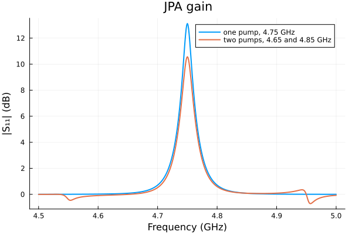
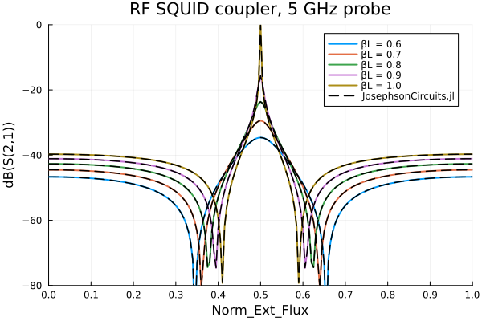
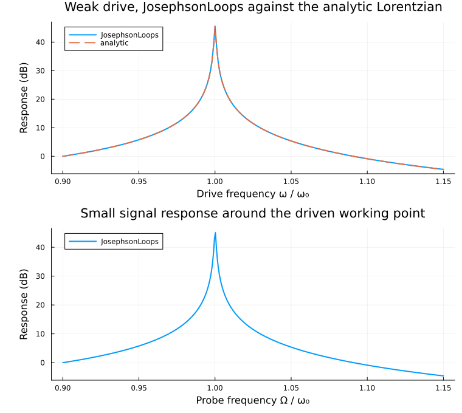

# JosephsonLoops.jl

JosephsonLoops.jl is an open source package for simulating lumped element superconducting
circuits containing Josephson junctions. A circuit is written as a list of loops, assembled
into a symbolic model, and that one model is then solved either in the time domain as an
initial value problem or in the frequency domain by harmonic balance.

The package is built on [ModelingToolkit.jl](https://github.com/SciML/ModelingToolkit.jl).
Every component is an acausal ModelingToolkit model, the circuit equations stay symbolic all
the way to the solver, and any quantity that can be written as an expression of the model's
variables can be read back from a solution.

## What it is for

JosephsonLoops.jl is aimed at strongly pumped nonlinear circuits with a modest number of
junctions: parametric amplifiers, flux tunable couplers, SQUIDs, and any driven nonlinear
oscillator that can be written as a differential equation. Its strengths are the things that
matter in that regime.

- The working point is solved with the full nonlinearity, not a Taylor expansion of it, so
  strongly pumped operating points and their harmonics are captured.
- The small signal response around a working point is exact in the detuning for the chosen
  basis, which is what amplifier gain and S parameters need.
- Two pumps at once are supported, with the collocation grid chosen from the tone ratio.
- The same model integrates in the time domain, so transients, start up and bistability are
  available alongside the steady state, and any harmonic balance result can be checked
  against a time domain solve of the same circuit.
- External flux and mutual inductance are part of the netlist, because the formulation is
  written in loop currents.

It is not currently optimised for large junction arrays. The symbolic build grows with the
size of the circuit, so a travelling wave amplifier with hundreds of cells is out of reach
of this release. That is a matter of implementation rather than formulation, and it is
being worked on.

## Contents

- [Why loop currents](#why-loop-currents)
- [Acausal, symbolic components](#acausal-symbolic-components)
- [Installation](#installation)
- [Quick start](#quick-start)
- [Defining a circuit](#defining-a-circuit)
- [Units and normalisation](#units-and-normalisation)
- [Time domain](#time-domain)
- [Harmonic balance](#harmonic-balance)
- [Reading any expression](#reading-any-expression)
- [Small signal analysis](#small-signal-analysis)
- [Examples](#examples)
  - [Josephson parametric amplifier](#josephson-parametric-amplifier)
  - [rf-SQUID coupler](#rf-squid-coupler)
  - [Driven Duffing oscillator](#driven-duffing-oscillator)
- [Current status](#current-status)

## Why loop currents

Most harmonic balance simulators for superconducting circuits use a nodal
formulation. They solve for node fluxes. JosephsonLoops.jl uses a mesh formulation instead.
It solves for loop currents, and the circuit is entered as a list of loops rather than as a
list of node pairs.

Two practical consequences follow from this.

External flux is a first class part of the netlist. You mark which loops are threaded by
external flux and set the flux directly as a parameter. In a nodal formulation, applying
external flux normally requires a DC current source at an extra port coupled through a
mutual inductor, plus a large parallel inductor to keep the DC node flux from floating.

Flux quantisation is enforced by construction, because each loop equation is a statement
about the flux around that loop.

## Acausal, symbolic components

Nothing in the component library is a hand written stamp. Each component is a
ModelingToolkit model that states its own physics and nothing else, and the circuit is the
set of connections between them. The solver never sees a circuit; it sees a system of
equations.

A loop is a connector carrying the flux delivered to that loop and the loop's mesh current.

```julia
@connector Loop begin
    Φ(t), [connect = Flow]
    iₘ(t)
end
```

Every two terminal element extends a common `Branch`, which sits between two loops. The
branch current is the difference of the two mesh currents, the flux leaving one loop enters
the other, and the branch phase is the flux it delivers. A component then adds its one
constitutive equation.

```julia
@mtkmodel Branch begin
    @components begin
        in = Loop()
        out = Loop()
    end
    @variables begin
        φ(t)
        i(t)
    end
    @equations begin
        i ~ in.iₘ - out.iₘ
        0 ~ in.Φ + out.Φ
        φ ~ out.Φ
    end
end

@mtkmodel Capacitor begin
    @extend Branch()
    @parameters begin
        βc = 1.0
    end
    @equations begin
        D2(φ) ~ i/βc
    end
end
```

Because the components are acausal, larger parts are built by composition rather than by
deriving new equations. A port is nothing more than a resistor and a current source
connected in parallel, with the port current and voltage exposed as variables.

```julia
@mtkmodel Port begin
    @components begin
        Rₙ = Resistor()
        source = CurrentSource()
        in = Loop()
        out = Loop()
    end
    @variables begin
        i(t), [irreducible = true]
        dφ(t), [irreducible = true]
    end
    @equations begin
        connect(source.in, Rₙ.in)
        i ~ source.i - Rₙ.i
        dφ ~ D(Rₙ.φ)
        connect(Rₙ.out, in)
        connect(source.out, out)
    end
end
```

A custom subcomponent is written the same way: extend `Branch` with a new constitutive
equation, or compose existing components as the port does. The harmonic balance and time
domain solvers accept any ModelingToolkit system, so a circuit assembled by hand from such
components, or a bare differential equation with no circuit at all, goes through exactly the
same code path as a netlist. The Duffing oscillator example is that case. The netlist parser
itself recognises the six prefixes listed under Defining a circuit, so a new component type
is used through a hand assembled model or by giving it a prefix in `build_circuit`.

The symbolic pipeline continues past the model. The Fourier ansatz is substituted
symbolically, the collocation residuals and the three jacobians of the linearised problem
are symbolic matrices, and a solved problem can be queried with any expression of the
model's variables and parameters, which is described under Reading any expression.

## Installation

The package is not registered. Install it directly from the repository.

```julia
using Pkg
Pkg.add(url = "https://github.com/WilliamCam/JosephsonLoops.git")
```

To work on the package itself, clone it and develop the local copy.

```julia
using Pkg
Pkg.develop(path = "path/to/JosephsonLoops")
```

Julia 1.12 or later is required. The floor comes from the `LinearAlgebra = "1.12.0"` compat
entry, since that stdlib tracks the Julia version. The simulation path is built on
ModelingToolkit, Symbolics, NonlinearSolve and DifferentialEquations, and figures use Plots.
The first build of a harmonic system is a symbolic operation, so expect the first call in a
session to be slow.

The public API is exported: `process_netlist`, `build_circuit`, `tsolve`, `HarmonicSystem`,
`HarmonicProblem`, `LinearisedProblem`, `solve!`, `get_solution`, `perturbation_response`,
`get_HB_scattering_matrix` and the flux quantum `Φ₀`. Each of these carries a docstring
giving its arguments, return values and known traps.

```julia
using JosephsonLoops

?HarmonicSystem
```

## Quick start

One loop holding a port, a coupling capacitor and a junction in series. This is the circuit
used for the parametric amplifier example below.

```julia
using JosephsonLoops

# one loop containing a port, a coupling capacitor and a junction
loops = [["P1", "C1", "J1"]]
circuit = process_netlist(loops)
jpa, u0, guesses = build_circuit(circuit)

# choose the normalisation scales
I₀ = Φ₀/(2π*1000.0e-12)     # critical current of a 1000 pH junction
R₀ = 10.0e3                  # reference resistance
ωc = R₀*I₀/(Φ₀/2π)           # characteristic frequency

ps = Dict(
    jpa.P1.source.ω => 2π*4.75001e9/ωc,   # drive frequency
    jpa.P1.source.I => 11.3e-9/I₀,        # drive amplitude
    jpa.P1.Rₙ.r     => 50.0/R₀,           # 50 ohm port
    jpa.C1.βc       => 100.0e-15*R₀*ωc,   # 100 fF coupling capacitor
    jpa.J1.βc       => 1000.0e-15*R₀*ωc,  # 1000 fF junction capacitance
    jpa.J1.r        => 1e8/R₀,            # junction shunt resistance
    jpa.J1.α        => 1.0,               # junction critical current, in units of I₀
)

# harmonic balance with 2 harmonics of the drive
sys = HarmonicSystem(jpa, jpa.P1.source.ω, 2)

# sweep the drive frequency, removed here from the fixed parameters. delete! mutates, so
# the copy keeps ps intact for later use
ω_vec = collect(2π*(4.5:0.001:5.0)*1e9/ωc)
sweep_params = delete!(copy(ps), jpa.P1.source.ω)
prob = HarmonicProblem(sys, sweep_params, parameter_sweep = [jpa.P1.source.ω => ω_vec])
solve!(prob)

# first harmonic of the port current and voltage
I1 = get_solution(prob, jpa.P1.i, 1) .* I₀
V1 = get_solution(prob, jpa.P1.dφ, 1) .* R₀ .* I₀
```

`get_solution` returns a complex phasor for the requested harmonic. Order `1` is the drive
frequency, `2` is its second harmonic, and `0` is DC. For two tone problems the order is a
tuple, so `(1, -1)` is the mixing product at `ω1 - ω2`.

## Defining a circuit

A circuit is a vector of loops. Each loop is a vector of component names. A component that
appears in two loops is the shared branch between them.

```julia
loops = [["P1", "L1"], ["L1", "J1", "L2"], ["L2", "P2"]]
circuit = process_netlist(loops, ext_flux = [false, true, false])
model, u0, guesses = build_circuit(circuit)
```

The first letter of a component name selects its type.

| Prefix | Component | Parameters | Defining equation |
|---|---|---|---|
| `R` | Resistor | `r` | `D(φ) ~ i*r` |
| `C` | Capacitor | `βc` | `D2(φ) ~ i/βc` |
| `L` | Inductor | `βL` | `out.Φ ~ βL*i` |
| `J` | Josephson junction | `βc`, `r`, `α` | `D2(φ) ~ (i - α*sin(φ) - D(φ)/r)/βc` |
| `I` | Current source | `I`, `ω`, `I₂`, `ω₂` | `i ~ I*sin(ω*t) + I₂*sin(ω₂*t)` |
| `P` | Port | `Rₙ.r`, `source.I`, `source.ω` | resistor in parallel with a current source |

Any other first letter raises an error naming the component and the supported prefixes.

Component handles are reached through the model that `build_circuit` returns, as `jpa.J1`
or `model.P1` above. A parameter is a field of its component, for example `model.J1.α`. The
names come from the netlist strings, so they do not exist before `build_circuit` is called.

A port is a composite. It contains a resistor `Rₙ` and a current source `source`, and it
exposes the port current `i` and the port voltage `dφ`. Port parameters are reached through
those subcomponents, for example `model.P1.Rₙ.r` and `model.P1.source.ω`.

The current source carries an optional second tone through `I₂` and `ω₂`. It defaults to
zero amplitude, so single tone circuits are unaffected. Both pumps of a two tone problem
should be driven through one port using this second tone. Adding a second source as its own
netlist component inserts an extra branch and changes the circuit.

Two optional keyword arguments extend the netlist.

`mutual_coupling` is a vector of loop index pairs. Each pair creates a plain inductor named
`M` followed by the two loop numbers, placed as a branch shared by both loops. This is the
common branch representation of mutual inductance in mesh analysis, rather than a separate
coupling coefficient. Its single parameter is a normal `βL`, so `mutual_coupling = [(1, 2)]`
creates `M12` and its mutual inductance is set through `model.M12.βL`.

`ext_flux` is a vector of booleans, one per loop. Each `true` entry threads that loop with an
external flux source named `Φₑ` followed by the loop number. Loop 2 in the example above gets
`model.Φₑ2.Φₑ`.

## Units and normalisation

The package works in normalised units. Fluxes are in units of `Φ₀/2π`, currents in units of
a reference current `I₀`, resistances in units of a reference resistance `R₀`, and time in
units of `1/ωc`. You choose `I₀` and `R₀`, and the characteristic frequency follows.

```julia
ωc = R₀*I₀/(Φ₀/2π)
```

A convenient choice is to set `I₀` to the critical current of the main junction, because then
that junction has `α = 1`. The flux quantum is available as `Φ₀`.

Convert SI values as follows.

| Physical quantity | Normalised parameter | Conversion |
|---|---|---|
| Resistance `R` in ohms | `r` | `R/R₀` |
| Capacitance `C` in farads | `βc` | `C*R₀*ωc` |
| Inductance `L` in henries | `βL` | `L*I₀/(Φ₀/2π)` |
| Critical current `Ic` in amps | `α` | `Ic/I₀` |
| Source current in amps | `I` | `I/I₀` |
| Frequency `f` in hertz | `ω` | `2π*f/ωc` |
| External flux in units of `Φ₀` | `Φₑ` | `2π*flux` |

Results come back normalised, so multiply currents by `I₀` and voltages by `R₀*I₀` to return
to SI units.

## Time domain

The model that harmonic balance works on is an ordinary system of differential equations,
and it can be integrated as one. Nothing has to be re-entered or re-derived: the same
`build_circuit` output, the same parameter dictionary and the same component handles go
straight into an initial value problem.

```julia
tspan = (0.0, 1e-6) .* ωc
tsol = tsolve(model, guesses, ps, tspan; guesses = guesses)
plot(tsol[model.C1.i] .* I₀)
```

`tspan` is in normalised time, so multiply the physical duration by `ωc`. An optional
`saveat` argument controls the output sampling, and `DAE = true` integrates the model as a
DAE instead of an ODE. The solution is indexed by any variable of the model, as
`tsol[model.C1.i]` above.

This matters for three kinds of question that a steady state solver cannot answer. A start
up transient, a pulsed drive or a sudden change of bias is a time domain problem by nature.
A bistable circuit reaches one of its states depending on how it got there, which a time
domain solve shows directly. And a harmonic balance result at a strongly pumped working
point deserves a check against a solver that makes no assumption about the form of the
solution: integrate the same circuit from rest, wait for the transient to die, and compare
the amplitude of the last periods with the harmonic balance fundamental. The amplifier
example does exactly that and finds agreement to 0.42 percent.

Time domain solves are far slower than harmonic balance for steady state sweeps, which is
the reason harmonic balance exists.

## Harmonic balance

Harmonic balance assumes the solution is a Fourier series in the drive tones, substitutes
that series into the circuit equations symbolically, samples the result on a collocation
grid, and solves the resulting algebraic system for the Fourier coefficients. The
nonlinearity is kept whole, so the working point of a strongly pumped circuit, including
its harmonics and its DC shift, comes out of the same solve.

Build a harmonic system by naming the drive parameter and the number of harmonics.

```julia
sys = HarmonicSystem(model, model.P1.source.ω, N; determine_jacobian = false)
```

`N` is the number of harmonics of the drive retained in the basis. `N = 2` keeps DC, the
fundamental and the second harmonic. Increasing `N` improves accuracy and costs build time.
For the parametric amplifier below, `N = 2` gives 13.119 dB and `N = 3` gives 13.295 dB
against a reference value of 13.301 dB, so `N = 3` is converged for that circuit.

Set `determine_jacobian = true` if you intend to do small signal analysis afterwards. This
builds the additional matrices the linearised solver needs. It also forces `tearing = false`,
because the linearised solve needs every system variable to survive into the final model.

For a steady state sweep, wrap the system in a `HarmonicProblem`.

```julia
prob = HarmonicProblem(sys, ps, parameter_sweep = [model.P1.source.ω => ω_vec])
solve!(prob)
result = get_solution(prob, model.P1.i, 1)
```

`solve!` continues by default: each point of the first sweep axis starts from the previous
converged solution, which is what lets a sweep follow a nonlinear branch. Passing more than
one pair sweeps a grid, and `get_solution` then returns an array with one axis per swept
parameter.

The examples delete the swept parameter from `ps` first. That is a convenience, not a
requirement: every component parameter carries a default, so the problem can be built without
it. A parameter with no default, such as one declared with `@parameters` on a differential
equation of your own, must still be given a value, because the problem is built before the
sweep starts.

### Two tones

Pass a tuple of two drive parameters to build a two tone system.

```julia
sys = HarmonicSystem(model, (model.P1.source.ω, model.P1.source.ω₂), 2,
    determine_jacobian = true,
    intermod_order = 3,
    tones = (4.65001e9, 4.85001e9))
```

`intermod_order` controls which mixing products enter the basis. With `intermod_order = 0`
the basis holds only pure harmonics of each tone. Raising it admits mixing products `(m, n)`
at frequency `m*ω1 + n*ω2` subject to `m + |n| <= intermod_order`, which is where parametric
conversion between the tones actually happens. For the doubly pumped amplifier below the peak
gain is 15.2 dB at order 0, 11.8 at order 2 and 10.57 at order 3, converging onto the
reference value of 10.553 dB. Order 0 is not a useful setting for a strongly driven circuit.

`tones` takes the two drive frequencies as plain numbers. Only their ratio is used, so any
consistent unit works. The backend inspects that ratio and chooses a collocation grid.

If the ratio is close to a small rational number, the two tones share a common base frequency
`ω0` with `ω1 = p*ω0` and `ω2 = q*ω0`. Every mixing product is then an integer harmonic of
`ω0`, one period of `ω0` is a valid sampling window, and a one dimensional grid is exact. The
frequencies above rationalise to 93:97, which moves the second tone by 430 Hz. The chosen
ratio and the size of that shift are reported when the system is built, and `ω₂` should be
set to the shifted value so that the parameter and the grid agree.

If the ratio is not close to a small rational number, or if `tones` is omitted, the backend
falls back to sampling the two tone phases independently, so both drive frequencies stay
symbolic and no shift is applied to either tone.

The grid choice only matters once the basis is converged. At `intermod_order = 0` the result
is several dB out at the gain peak whatever the grid, because the basis does not contain the
mixing products that carry the parametric conversion.

Two keyword arguments tune the choice. `commensurate_tol` is the relative tolerance for
accepting a rational ratio, and defaults to `1e-6`. `max_denominator` caps the integers that
may be used, and defaults to `1000`. A third argument, `oversample`, increases the number of
collocation points beyond the minimum, which pushes aliased content off the occupied basis
slots.

### Working points

Strongly driven circuits have more than one solution, and a cold solve can land on the
trivial one. The reliable approach is to ramp the drive amplitude and carry each solution
forward as the starting guess for the next step. A `HarmonicProblem` without a sweep solves
a single point, and its result is the state vector, so the ramp is a short loop.

```julia
U = zeros(length(unknowns(sys.system)))      # unknowns comes from ModelingToolkit
for frac in (0.05, 0.15, 0.3, 0.5, 0.7, 0.85, 1.0)
    p = merge(ps, Dict(model.P1.source.I => frac*Ip, model.P1.source.I₂ => frac*Ip))
    step = HarmonicProblem(sys, p, U₀ = U)
    solve!(step)
    global U = real.(step.result.solution)
end
```

Two parameters that must change together, such as the two pumps here, are ramped in the same
loop rather than through a sweep axis, because a sweep moves one parameter per axis.

## Reading any expression

A solved problem is not read by picking rows out of a state vector. `get_solution` takes any
symbolic expression built from the model's variables and parameters. Each variable in it is
replaced by the complex coefficient of the requested Fourier component, the expression is
evaluated on those phasors, and the result comes back at every sweep point or probe
frequency.

The simplest expression is a variable, as in the quick start. The amplifier example reads the
reflection at a port, which is a ratio of port waves that mixes the port voltage, the port
current and the port resistance, and it does so with one line.

```julia
s11 = get_HB_scattering_matrix(model, '1', '1')[1]    # a symbolic expression in P1.dφ, P1.i and P1.Rₙ.r
S11 = get_solution(prob, s11, 1)                       # its fundamental at every sweep point
gain_dB = 20 .* log10.(abs.(get_solution(lin, s11, 1)))   # the same expression on a linearised problem
```

Any other expression of the phasors works the same way: a phase difference between two
junctions, the ratio of two currents, a scattering parameter you write yourself, a current
that is not a state of the model. Variables that `build_circuit` eliminated during
simplification are reconstructed through the model's observed equations, so an expression
can name them freely.

The same holds for a system that is not a circuit. The Duffing oscillator example hands a
bare differential equation to `HarmonicSystem`, sweeps it, and reads its variable `x` with
the same `get_solution` call the circuit examples use.

## Small signal analysis

Once a working point is known, the response to a weak probe is a linear problem. This is how
amplifier gain and S parameters are computed. The pump stays fixed and the probe frequency is
swept across it.

```julia
sys = HarmonicSystem(model, model.P1.source.ω, 2, determine_jacobian = true)
δU  = perturbation_response(sys, model.P1.source.I, ps, amplitude = ps[model.P1.source.I])
lin = LinearisedProblem(sys, ps, δU, Ω_vec, U₀ = U)
solve!(lin)

I_sig = get_solution(lin, model.P1.i, 1) .* I₀
V_sig = get_solution(lin, model.P1.dφ, 1) .* R₀ .* I₀
```

`perturbation_response` builds the drive vector for a small modulation of the named
parameter. `LinearisedProblem` takes that vector and the list of probe frequencies `Ω_vec`.
The optional `U₀` is the working point computed above. `get_solution` then returns the
complex response at each probe frequency, for a variable or for any expression, as described
above.

Internally the linearised operator is assembled from three symbolic jacobians. A probe at
frequency `Ω = ω1 + δ` puts a slowly rotating envelope on every Fourier coefficient. Because
the circuit equations contain second time derivatives, the operator is exactly quadratic in
the detuning, and the solved matrix is `J₀ - iδJ₁ - δ²J₂`. The series terminates, so the
linearised response is exact in the detuning for the chosen basis.

## Examples

The example scripts live in `src/examples`, and all of them run as written. Each one prints
the numbers quoted here, and the amplifier example regenerates its own figure.

| Example | What it demonstrates |
|---|---|
| `JPA.jl` | one pump and then two pumps through one port, amplifier gain from a symbolic S11, a time domain check of a working point |
| `rf-squid-coupler.jl` | flux swept working points with continuation, two port S21 |
| `duffing-oscillator.jl` | the solver on a bare differential equation, with no circuit or netlist |

### Josephson parametric amplifier

A single junction parametric amplifier. The circuit is a 50 ohm port, a 100 fF coupling
capacitor, and a 1000 pH junction shunted by 1000 fF, all in one loop. 



The example drives it twice. With one pump at 4.75001 GHz and 11.3 nA, the gain peak is
13.119 dB at 4.750 GHz with a 3 dB bandwidth of 12.0 MHz. 

The same working point is then integrated in the time domain from rest at the pump frequency.
The amplitude of the port current in the last periods of the transient is 9.394 nA against
the harmonic balance fundamental of 9.434 nA, a difference of 0.42 percent. This is the
package checking itself: the two solvers share a model and nothing else.


Script: `src/examples/JPA.jl`.

### rf-SQUID coupler

A two port flux tunable coupler. A junction sits in series between two ports, and the loop
formed with the two grounding inductors is threaded by external flux. Transmission through
the coupler is controlled by that flux. This circuit is figure 8 of
[arXiv:2408.07861](https://arxiv.org/abs/2408.07861).



There is no pump in this example. The working point is the flux biased DC state and the
5 GHz probe enters only through the linearised response. Transmission rises from about
-40 dB at zero flux to a peak at half a flux quantum, with the peak height set by `βL`. At
`βL = 1` the coupler reaches 0 dB. Sharp transmission nulls appear on either side of the
peak, and their positions depend on `βL`. The external flux is a netlist parameter here, set
and swept like any other, which is the loop formulation doing what it was chosen for.

Both ports must have their source amplitude set to zero. The port current source defaults to
an amplitude of 1, so an unset second port silently drives the circuit.

Script: `src/examples/rf-squid-coupler.jl`.

### Driven Duffing oscillator

Not a circuit. The harmonic balance backend takes any ModelingToolkit system

```
ẍ + γẋ + ω₀²x + αx³ + ηẋx² = F cos(ωt)
```

which is written directly as a differential equation, with `@variables` and `@parameters`,
and handed to `HarmonicSystem` without a netlist in the way. It is worth having because the
answer is known in closed form in two limits.



At a weak drive the response must be the linear Lorentzian, so the example checks it against
the closed form: the peak is 0.00995 against an analytic 0.01, the largest deviation being
0.52 percent of the peak. That is the solver measured against an exact answer rather than
against another solver. The second panel is the small signal response around that working
point, which is the same linearisation the amplifier example uses for gain; at this working
point the probe sees the oscillator's own resonance, 303 times its off resonant level. The
variable `x` and its response are read with the same `get_solution` call the circuit examples
use, because to the solver an oscillator and a circuit are the same kind of object.

This oscillator is also bistable once the drive bends the resonance, but its fold lies outside
any window that still contains the linear resonance, so it is left out.

Script: `src/examples/duffing-oscillator.jl`.

## Current status

This package is under active development as part of a honors thesis. The following areas are
known to be incomplete.

Large junction arrays are not practical yet. The symbolic build of a harmonic system grows
with the number of equations, so circuits with hundreds of junctions, such as travelling wave
parametric amplifiers, are outside the reach of this release. A numeric assembly of the same
formulation is in development.

Parameter sweeps in `LinearisedProblem` are not implemented. Passing `parameter_sweep` sizes
the result but the sweep branch of `solve!` raises an error, so linear component sweeps still
require re-solving the working point.

There is no test suite. Correctness is currently established by the examples above.

Building a `LinearisedProblem` substitutes the harmonic system's symbolic jacobians numerically
each time, so a sweep that constructs one per point is dominated by that cost rather than by the
linear solve. The coupler example, which builds a thousand of them, spends most of its runtime
there. Working points swept through `HarmonicProblem` do not pay this.

A parameter sweep moves one parameter per axis, so two parameters that must change together,
such as the two loop inductors of a SQUID or the two tones of a doubly pumped amplifier, need
a loop around the sweep rather than a sweep axis of their own.

`solve!` does not forward keyword arguments to the nonlinear solver, so the algorithm cannot
be chosen through `HarmonicProblem` or `LinearisedProblem`.

`HarmonicSystem` warns that the harmonic system is overdetermined by one equation and drops
the last one. The redundancy is real, because the DC coefficients carry a gauge freedom, but
which equation is dropped depends on the variable order.

`get_HB_scattering_matrix` is correct for a one port network. Its loop over ports is written
`for k in N_ports`, which iterates once over the integer rather than over the ports, so the
two port case leaves the first wave at zero. The coupler example computes S21 from the port
waves directly for that reason.


`build_circuit` prints the branch names and the full component dictionary on every call, with
no way to silence it. The second return value, `u0`, is always an empty vector, because the
line that would populate it is commented out. Pass `guesses` where an initial state is needed,
which is what the examples do.
